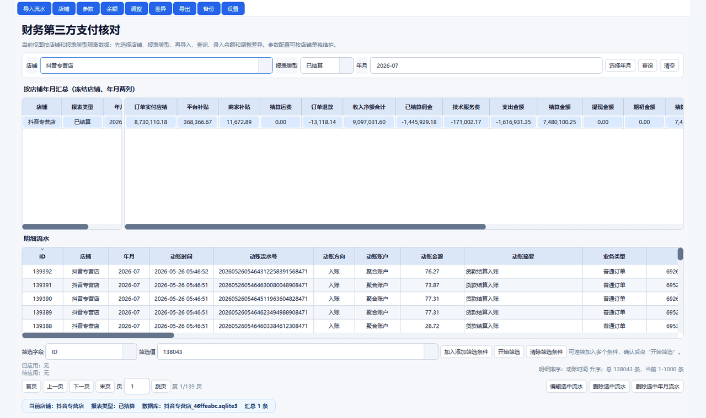

# 财务第三方支付核对 Qt 版

一个用于店铺第三方支付资金流水核对的 Windows 桌面程序。程序使用 Qt/PySide6 开发，数据使用 SQLite 本地落盘，支持按店铺隔离数据库、导入 Excel/CSV、汇总核对、差异说明、手工调整、备份还原和历史查询。

当前版本：`v1.0.3`

## 实际界面录屏



## 核心流程

1. 在首页选择店铺和报表类型。
2. 点击“导入流水”，在同一个弹窗里选择店铺、报表类型、归属年月和文件。
3. 导入后按年月区间查询汇总，查看结算金额、余额差异和明细流水。
4. 录入期初金额、店铺期末余额，系统计算“结算期末余额”并给出差异。
5. 有差异时可查看差异明细，也可新增手工调整并记录说明。
6. 需要留档时导出 XLSX，导出文件包含汇总表和原始表格。
7. 使用“备份”功能备份或还原全部/部分店铺数据库及配置。

## 文档

- [需求说明与设计方案](docs/需求说明与设计方案.md)
- [更新日志](CHANGELOG.md)
- [v1.0.3 发布说明](RELEASE_NOTES_v1.0.3.md)

## v1.0.3 功能

- 店铺优先布局：先选择店铺，再查看该店铺的汇总和明细。
- 每个店铺使用独立 SQLite 数据库，主库只保存店铺清单和全局配置。
- 店铺名称可直接编辑，历史流水、余额、调整和字段配置同步更新。
- 参数配置支持冻结栏字段、活动栏字段、计算口径、分页配置和字段排序。
- 导入支持 Excel 和 CSV，CSV 兼容 UTF-8 BOM 与 GB18030。
- 导入前可选择店铺、报表类型、归属年份和月份，年份范围为 2025-2099。
- 报表类型支持“已结算”和“未结算”，汇总、余额、调整、明细和导出均按报表类型隔离。
- 明细流水支持分页、跳页、表头排序和多字段精确筛选。
- 大数据导入、查询、筛选和导出做了分页/分批优化，状态栏显示进度。
- 汇总表冻结区和活动区之间可拖动调整宽度，列宽按内容自动适配。
- 差异明细使用表格化页面展示，保留差异原因和手工调整说明。
- 导出 XLSX 文件名、汇总 sheet 顶部信息包含店铺、年月区间和导出时间。
- 导出完成弹窗支持直接打开文件。
- 全局设置支持开机自启动、点击 X 最小化到托盘。
- 新增备份还原，可备份/还原全部或部分店铺数据库和配置。
- 弹窗按钮统一改为中文场景文案，例如“开始导入”“保存设置”“退出”。

## 默认计算口径

```text
收入净额合计 = 订单实付应结 + 平台补贴 + 商家补贴 + 结算运费 + 订单退款
支出金额 = 已结算佣金 + 技术服务费
结算金额 = 收入净额合计 + 支出金额
结算期末余额 = 期初金额 + 收入净额合计 + 支出金额 + 提现金额
差异 = 结算期末余额 - 店铺期末余额
```

不同店铺的原始字段、汇总字段和计算口径可以在“参数配置”中维护。

## 数据存储

```text
data/reconciliation.sqlite3    # 主库：店铺清单、全局设置
data/stores/*.sqlite3          # 店铺独立库：流水、余额、调整、字段配置
```

数据库文件不会提交到源码仓库，首次运行程序时会自动创建。

## 本地运行

```powershell
python -m pip install -r requirements.txt
python qt_app.py
```

也可以双击 `启动Qt版.bat`。

## Windows Release

正式发布包包含：

- `财务第三方支付核对-Qt版-v1.0.3.exe`
- `使用说明.md`
- `RELEASE_NOTES_v1.0.3.md`

下载 exe 后可直接运行。数据默认保存在 exe 同级目录下的 `data` 文件夹中。
